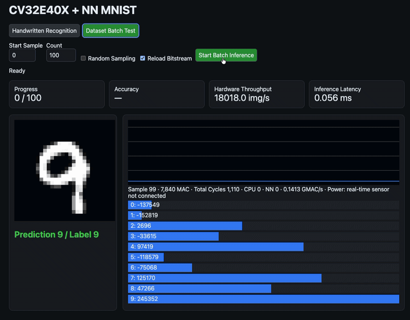
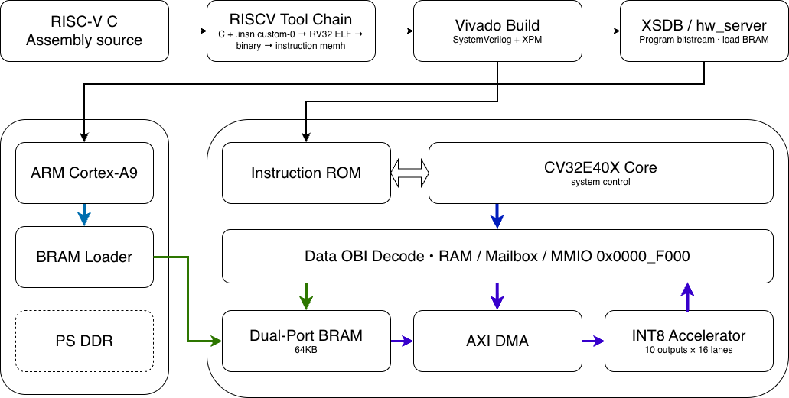

# CV32E40X CV-X-IF INT8 Neural-Network Accelerator

## 1. Project Scope

This repository implements an FPGA-oriented neural-network acceleration platform based on the OpenHW Group CV32E40X processor. A custom INT8 coprocessor is connected to the processor through the Core-V eXtension Interface (CV-X-IF), allowing software to invoke neural-network operations as custom RISC-V instructions.

The project covers the complete path from instruction decoding and coprocessor execution to DMA-based data movement, FPGA integration, bare-metal software, MNIST inference, and browser-based result visualization.

The current FPGA target is the MicroZed board with the Xilinx Zynq-7020 device.

## 2. Demonstration

<p align="center">
  
</p>


## 3. System Architecture

<p align="center">
  
</p>

| Layer | Component | Responsibility |
|---|---|---|
| Processor | CV32E40X | Executes RV32IM_Zicsr bare-metal software and issues custom neural-network instructions. |
| Extension interface | CV-X-IF | Transfers custom instructions, operands, commit information, and results between the CPU and coprocessor. |
| Instruction accelerator | NN coprocessor | Implements scalar and packed INT8 operations used by quantized neural-network workloads. |
| Matrix accelerator | DMA-backed MAC array | Reads operands through AXI and performs parallel INT8 multiply-accumulate operations. |
| Control plane | AXI GP interface | Exposes accelerator configuration and status registers to the Zynq processing system. |
| Data plane | AXI HP interface | Provides high-bandwidth access from programmable logic to external DDR memory. |
| Software | RV32 bare-metal runtime | Configures the accelerator, prepares input data, starts inference, and collects counters and results. |
| Visualization | Python HTTP dashboard | Supports handwritten input, batch tests, prediction display, accuracy tracking, and performance reporting. |

A typical execution path is:

```text
RV32 software
    -> custom instruction or MMIO command
    -> CV32E40X / CV-X-IF
    -> INT8 coprocessor or DMA MAC accelerator
    -> AXI data transfer
    -> DDR-backed tensors
    -> inference result and performance counters
```

## 4. Technology Features

### 4.1 Tightly Coupled RISC-V Acceleration

The instruction-level accelerator uses CV-X-IF rather than a processor-specific internal modification. This separates the processor core from the custom neural-network execution logic while retaining a tightly coupled programming model.

The coprocessor design includes the following protocol behavior:

| Requirement | Design behavior |
|---|---|
| Instruction issue | Custom instruction and source operands are accepted through the CV-X-IF issue channel. |
| Commit tracking | Execution is coordinated with the processor commit state. |
| Result delivery | Results are returned through the CV-X-IF result channel. |
| Multi-cycle execution | Operations may complete after multiple cycles. |
| Backpressure | Requests and results remain stable until the corresponding handshake completes. |
| Kill and flush handling | Speculative or cancelled instructions do not produce architectural writeback. |
| Illegal encoding handling | Unsupported custom encodings are reported as illegal instructions. |

### 4.2 Custom INT8 Instruction Set

The custom operations use the RISC-V `custom-0` opcode space.

| Instruction | Operation | Intended use |
|---|---|---|
| `NN_DOTP4` | Four signed INT8 multiplications followed by accumulation | Packed dot products and dense-layer computation |
| `NN_RELU` | Replaces a negative signed value with zero | Activation function |
| `NN_CLIP8` | Saturates a signed value to the INT8 range | Quantized output limiting |
| `NN_MAX4` | Returns the maximum of four packed signed INT8 values | Reduction and pooling support |
| `NN_REQUANT` | Applies multiplier, rounded shift, zero point, and INT8 saturation | Quantized accumulator conversion |

`NN_DOTP4` processes four signed 8-bit lanes stored in two 32-bit source registers. The operation is stateless and returns a 32-bit accumulated result.

### 4.3 Quantized Neural-Network Datapath

The accelerator is designed around integer arithmetic suitable for FPGA implementation.

| Feature | Implementation significance |
|---|---|
| INT8 operands | Reduces storage and data-transfer requirements compared with floating-point inference. |
| Packed arithmetic | Uses each 32-bit register to carry four INT8 values. |
| Parallel multiply-accumulate | Maps repeated neural-network arithmetic onto parallel hardware. |
| Balanced adder structure | Reduces the combinational depth of packed dot-product accumulation. |
| Requantization support | Converts wide accumulators back to quantized activation values. |
| Saturation semantics | Produces deterministic behavior at the INT8 numeric limits. |

### 4.4 DMA and AXI Integration

The project includes a DMA-backed accelerator path for workloads larger than a single custom instruction.

| Interface | Function |
|---|---|
| AXI GP0 | Processor-side configuration and status access |
| AXI HP0 | Accelerator reads from the low 1 GiB DDR address space |
| MMIO base address | `0x43c00000` |
| Data movement | AXI read DMA transfers tensor data from external memory to the compute array |
| Compute organization | Parallel INT8 MAC array with FPGA DSP mapping |

This organization separates control traffic from bulk tensor movement and avoids transferring every operand through individual processor load/store operations.

### 4.5 Hardware and Software Co-design

The repository contains matching components at each abstraction level:

| Area | Repository content |
|---|---|
| RTL | Processor subsystem wrapper, CV-X-IF coprocessor, execution units, quantization logic, DMA, and MAC arrays |
| Simulation | Host-side and program-level verification infrastructure |
| Software | RV32 bare-metal tests, accelerator drivers, and inference programs |
| FPGA | MicroZed integration and Vivado build flow |
| Data preparation | MNIST conversion and memory-image generation scripts |
| User interface | Python-based local web server and browser dashboard |
| Documentation | Architecture, setup, interface, and deployment material |

### 4.6 Browser-Based FPGA Test Interface

The dashboard in `scripts/mnist_fpga_gui.py` provides two test modes.

| Mode | Function |
|---|---|
| Handwritten recognition | Accepts a digit drawn in the browser, converts it to a centered 28 × 28 grayscale image, sends it for FPGA inference, and displays the prediction. |
| Batch MNIST test | Selects sequential or random test samples, executes repeated inference, and reports accuracy and progress. |

The interface reports the latest prediction together with total cycles, CPU cycles, accelerator cycles, inference latency, throughput, MAC count, and derived GMAC/s. Power is not presented as a measured runtime value because a live board power sensor is not integrated into the current dashboard.

## 5. Implemented FPGA Result

The following values describe the documented MicroZed implementation result for the DMA-backed 4 × 4 INT8 array.

| Metric | Result |
|---|---:|
| Target device | Xilinx Zynq-7020 on MicroZed |
| Target clock | 100 MHz |
| Setup slack | 0.554 ns |
| LUT utilization | 2,055 |
| Register utilization | 2,759 |
| DSP48E1 utilization | 16 |
| Block RAM utilization | 0 |
| Vivado DRC errors | 0 |
| Generated outputs | Bitstream and XSA |

These figures apply to the documented implementation configuration and should not be treated as universal results for every accelerator variant or build setting.

## 6. Repository Layout

| Path | Description |
|---|---|
| `rtl/` | Synthesizable SystemVerilog processor integration and accelerator modules |
| `sim/` | Simulation support, testbenches, and host-side verification |
| `sw/` | RV32 bare-metal runtime, tests, and benchmarks |
| `scripts/` | Tool checks, data conversion, memory preparation, and GUI utilities |
| `docs/` | Architecture, interfaces, verification, setup, and deployment documentation |
| `fpga/` | AXI wrappers and the MicroZed Vivado build flow |
| `record.mov` | End-to-end project demonstration |

Important RTL modules include:

| File | Purpose |
|---|---|
| `rtl/cv32e40x_subsystem.sv` | CV32E40X subsystem integration |
| `rtl/xif_nn_coprocessor.sv` | Commit-aware CV-X-IF neural-network coprocessor |
| `rtl/nn_decoder.sv` | Custom instruction decoding |
| `rtl/nn_execution_unit.sv` | Operation dispatch and execution control |
| `rtl/nn_dotp4_unit.sv` | Packed four-lane INT8 dot product |
| `rtl/nn_quant_unit.sv` | Activation clipping and requantization logic |
| `rtl/nn_axi_read_dma.sv` | AXI tensor read engine |
| `rtl/nn_dma_mac_array.sv` | DMA-connected parallel MAC datapath |
| `rtl/nn_dma_mmio.sv` | Memory-mapped accelerator control interface |
| `rtl/nn_mnist_accel_10x16.sv` | MNIST-oriented accelerator datapath |

## 7. Build and Verification

### 7.1 Basic Checks

```sh
make help
make check-tools
make test-unit
```

The tool-check script reports unavailable dependencies without silently installing system software:

```sh
./scripts/check_tools.sh
```

### 7.2 Expected Tool Categories

| Purpose | Tools |
|---|---|
| RTL lint and simulation | Verilator, Icarus Verilog, cocotb, pytest |
| Synthesis checks | Yosys |
| RISC-V software | `riscv64-unknown-elf-*` or compatible RV32 multilib toolchain |
| FPGA implementation | AMD/Xilinx Vivado on Ubuntu x86-64 |
| GUI and data preparation | Python 3 |

The bare-metal software configuration uses:

```text
Architecture: rv32im_zicsr
ABI:          ilp32
Privilege:    Machine mode
```

### 7.3 GUI Execution

The dashboard expects the MNIST test dataset and the configured remote FPGA execution environment. Start it with:

```sh
python3 scripts/mnist_fpga_gui.py
```

By default, the server listens on `127.0.0.1:8765` and opens the browser automatically. Command-line options are available for selecting the host, port, or disabling automatic browser launch.

## 8. Verification Scope

The project verification targets both standard processor execution and the custom extension path.

| Verification area | Main checks |
|---|---|
| RV32 execution | Arithmetic, branches, loads/stores, multiplication/division, CSR access, and machine-mode behavior |
| CV-X-IF protocol | Handshake stability, backpressure, commit, kill/flush, reset behavior, and result delivery |
| Custom instructions | Functional correctness, signed INT8 interpretation, saturation, rounding, and illegal encodings |
| DMA path | Address generation, AXI reads, transfer completion, and compute-array input delivery |
| Program-level tests | Execution of custom operations from RV32 assembly or C software |
| FPGA implementation | Synthesis, placement, routing, timing, DRC, bitstream generation, and XSA export |
| Application test | MNIST inference, prediction reporting, batch accuracy, and performance counters |

## 9. Design Constraints and Current Limitations

| Item | Current state |
|---|---|
| Numeric format | INT8 inference with wider integer accumulation |
| Application focus | MNIST-style fully connected inference |
| Runtime model loading | Not yet implemented as a general model format |
| Convolution support | Not part of the current accelerator datapath |
| Floating-point support | Intentionally excluded |
| RISC-V Vector Extension | Not used |
| Power measurement | No live sensor integration in the dashboard |
| Portability | Core accelerator RTL avoids direct FPGA primitives; the `fpga/` integration remains platform-specific |

## 10. Technical Significance

The main technical contribution is the combination of three acceleration levels in one working design:

1. **Instruction-level acceleration** through a commit-aware CV-X-IF coprocessor.
2. **Datapath-level acceleration** through packed INT8 arithmetic and parallel MAC structures.
3. **System-level acceleration** through AXI DMA access to DDR-backed tensors.

This arrangement provides a clear separation between reusable processor-independent accelerator RTL and the board-specific FPGA integration layer. It also demonstrates the complete path from a custom instruction definition to software invocation, FPGA execution, application inference, and user-visible measurement.

## 11. Planned Extensions

| Extension | Engineering objective |
|---|---|
| Convolution engine | Support CNN workloads beyond fully connected MNIST inference |
| Configurable layer engine | Reuse the datapath across different model dimensions |
| Runtime model loading | Remove compile-time dependence on a fixed model layout |
| Additional counters | Separate transfer, queueing, compute, and software overhead |
| Board power telemetry | Report measured energy per inference rather than an estimate |
| Broader FPGA validation | Compare timing, utilization, and performance across target devices |
| Extended regression | Add randomized protocol, DMA, and numerical corner-case testing |

## 12. Third-Party Components

This project builds on the following external technologies:

| Component | Role |
|---|---|
| OpenHW Group CV32E40X | RISC-V processor core |
| Core-V eXtension Interface | Custom coprocessor interface |
| RISC-V ISA | Base instruction-set architecture |
| AMD/Xilinx Vivado | Zynq FPGA implementation flow |
| MicroZed | Hardware target platform |
| MNIST | Handwritten-digit evaluation dataset |

Third-party source code and generated outputs remain subject to their respective licenses and notices.
